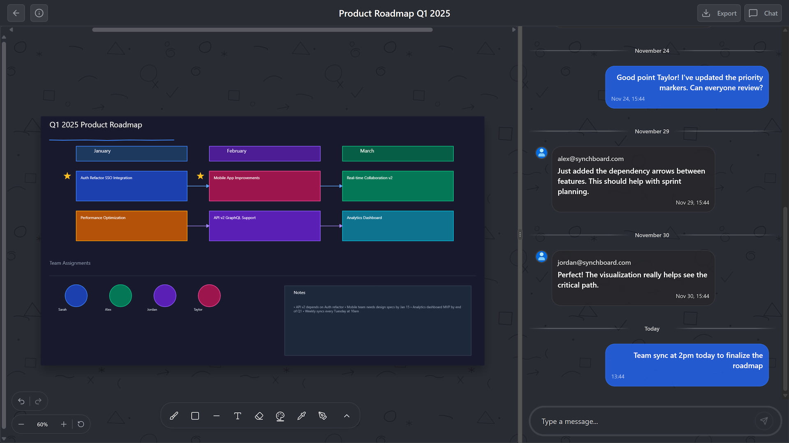
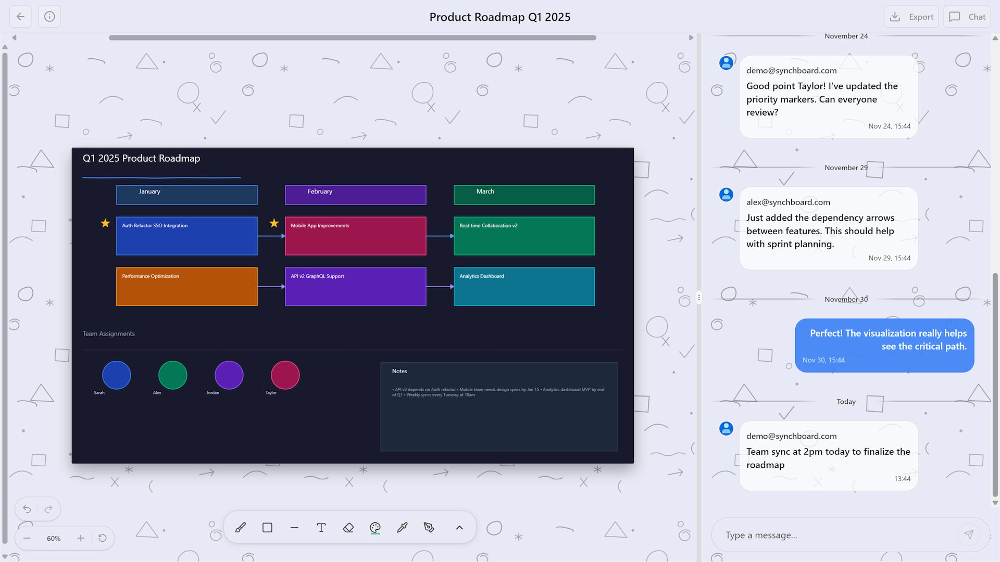
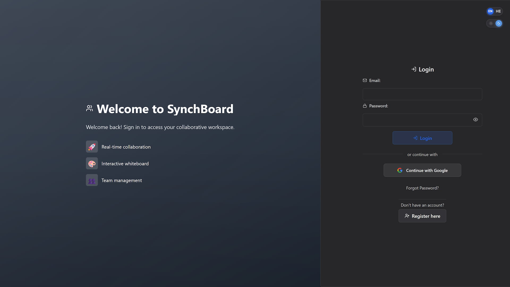
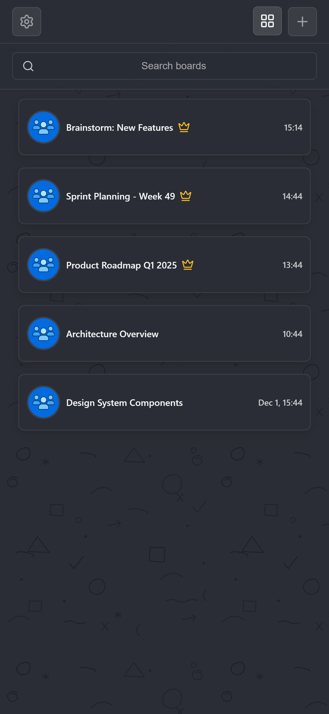
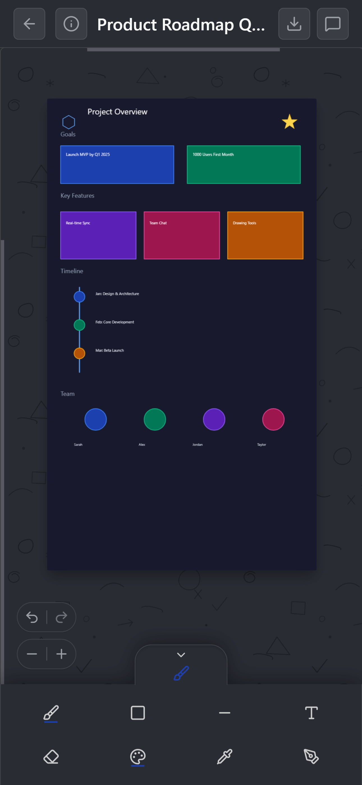
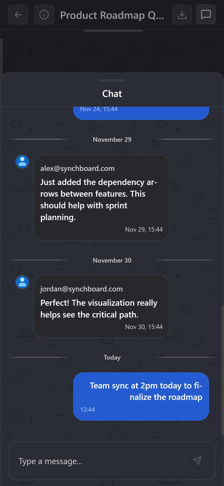

<div align="center">
  
  <h1>SynchBoard</h1>
  <p><strong>Real-time Collaborative Whiteboard</strong></p>
  <p>A production-ready full-stack application featuring WebSocket-powered real-time synchronization, JWT authentication, and seamless team collaboration.</p>

  <a href="https://synchboard.com">
    
  </a>

  <br/>

  [](LICENSE)
  [](https://github.com/sagi-menahem/SynchBoard/stargazers)
</div>

---

<div align="center">


</div>

---

## Preview

<div align="center">
  
</div>

---

## Features

### Real-time Collaboration

- WebSocket/STOMP synchronization via ActiveMQ Artemis
- Optimistic updates with automatic rollback
- Exponential backoff reconnection strategy
- Offline message queue processing

### Drawing Tools

- Freehand brush & eraser
- Shapes: rectangle, square, circle, triangle, pentagon, hexagon, star
- Lines: solid, dotted, arrow
- Text boxes with customizable fonts
- Color picker & recolor tool
- Canvas download functionality

### Board Management

- Create, share, and manage boards
- Role-based permissions (Admin/Member)
- Invite members via email
- Customizable canvas settings (size, background)

### Authentication & Security

- JWT-based authentication
- Google OAuth2 integration
- Email verification with Gmail SMTP
- Password reset functionality
- XSS protection & message sanitization

### User Experience

- Light/Dark theme support
- Internationalization (English & Hebrew RTL)
- Fully responsive design (desktop, tablet & mobile)
- Full undo/redo history per user
- Persistent user preferences

### Developer Experience

- Docker Compose orchestration
- Production-ready deployment scripts
- Swagger/OpenAPI documentation
- Multi-stage Docker builds
- Comprehensive type safety

---

## Screenshots

<div align="center">

### Theme & Language Support

| English - Dark | English - Light |
|:---:|:---:|
|  |  |

| Hebrew (RTL) - Dark | Hebrew (RTL) - Light |
|:---:|:---:|
|  |  |

### Application Pages

**Board List**


**Board Settings**


**User Settings**


**Authentication**



### Mobile Experience

| Board List - Grid | Board List - List |
|:---:|:---:|
|  |  |

| Canvas | Chat |
|:---:|:---:|
|  |  |

</div>

---

## Architecture

<div align="center">


</div>

<div align="center">

**Traffic Flow:**

1. HTTPS requests terminate at host Nginx with SSL/TLS
2. Frontend Nginx serves static assets and proxies API/WebSocket
3. Spring Boot handles business logic with JWT validation
4. Real-time updates broadcast via ActiveMQ STOMP relay to subscribed clients

</div>

---

## Tech Stack

| Layer              | Technologies                                                    |
| :----------------- | :-------------------------------------------------------------- |
| **Frontend**       | React 19, TypeScript 5.9, Vite 7.2, SCSS Modules, Framer Motion |
| **Backend**        | Java 24, Spring Boot 3.5, Spring Security, Spring WebSocket     |
| **Database**       | PostgreSQL 17, Spring Data JPA                                  |
| **Messaging**      | ActiveMQ Artemis, STOMP Protocol                                |
| **Infrastructure** | Docker, Nginx, Let's Encrypt SSL                                |
| **Authentication** | JWT, OAuth2 (Google), Gmail SMTP                                |

---

## Prerequisites

- **Docker** (recommended) - [Install Docker](https://docs.docker.com/get-docker/)
- Or for local development:
  - Node.js >= 20.0.0
  - Java 24+
  - PostgreSQL 17
  - ActiveMQ Artemis

---

## Quick Start

### Using Docker (Recommended)

```bash
# Clone the repository
git clone https://github.com/sagi-menahem/SynchBoard.git
cd SynchBoard

# Copy environment template
cp .env.example .env

# Start all services
docker-compose up --build
```

**Access Points:**

- Frontend: http://localhost
- Backend API: http://localhost:8080
- ActiveMQ Console: http://localhost:8161 (admin/admin)

### Local Development

```bash
# Start infrastructure only
docker-compose up -d postgres activemq

# Backend (from backend/)
gradlew.bat bootRun   # Windows
./gradlew bootRun     # Linux/Mac

# Frontend (from frontend/)
npm install && npm run dev
```

---

## Documentation

| Document                                                 | Description                               |
| :------------------------------------------------------- | :---------------------------------------- |
| [Installation Guide](docs/INSTALLATION.md)               | Local development & production deployment |
| [API Documentation](docs/API_DOCUMENTATION.md)           | REST API reference with examples          |
| [WebSocket Architecture](docs/WEBSOCKET_ARCHITECTURE.md) | Real-time communication & STOMP protocol  |
| [Authentication](docs/AUTHENTICATION.md)                 | JWT, OAuth2, and security implementation  |
| [Canvas Architecture](docs/CANVAS_ARCHITECTURE.md)       | Drawing system & object management        |
| [Database Schema](docs/DATABASE_SCHEMA.md)               | Entity relationships & data model         |
| [Docker Infrastructure](docs/DOCKER_INFRASTRUCTURE.md)   | Container setup & orchestration           |
| [Nginx Configuration](docs/NGINX_CONFIGURATION.md)       | Reverse proxy & SSL configuration         |
| [Security](docs/SECURITY.md)                             | Security measures & best practices        |
| [Error Handling](docs/ERROR_HANDLING.md)                 | Exception handling & error responses      |
| [Email Service](docs/EMAIL_SERVICE.md)                   | Gmail SMTP integration & email templates  |
| [File Storage](docs/FILE_STORAGE.md)                     | Image uploads & file management           |
| [History Management](docs/HISTORY_MANAGEMENT.md)         | Undo/redo system implementation           |
| [Performance](docs/PERFORMANCE.md)                       | Optimization strategies & caching         |
| [Contributing](docs/CONTRIBUTING.md)                     | Contribution guidelines                   |

---

## License

This project is licensed under the MIT License. See the [LICENSE](LICENSE) file for details.

---

<div align="center">

**Built by Sagi Menahem**

[](https://github.com/sagi-menahem)
[](https://www.linkedin.com/in/sagi-menahem/)

</div>
