<div align="center">
  
  <h1>SynchBoard - Real-time Collaborative Whiteboard</h1>
  <p>A full-stack collaborative whiteboard application featuring real-time synchronization, user authentication, and team collaboration tools.</p>

  <a href="https://synchboard.com">
    
  </a>
</div>

---

<div align="center">

### Tech Stack


</div>

---

## ✨ Preview

<div align="center">
  
  <p><i>SynchBoard workspace showing real-time collaborative drawing and team chat functionality</i></p>
</div>

---

## 🚀 Key Features

| Feature | Description |
|---------|-------------|
| **Real-time Collaboration** | Multiple users can draw and edit simultaneously with instant WebSocket synchronization via STOMP protocol |
| **User Authentication** | Secure JWT-based authentication with email verification and password reset functionality |
| **OAuth2 Integration** | Sign in with Google for seamless, passwordless access |
| **Board Management** | Create, share, and manage collaborative boards with granular team permissions |
| **Drawing Tools** | Comprehensive toolset including shapes, freehand drawing, lines, text, and customizable colors |
| **Live Chat** | Real-time messaging within boards for effective team communication |
| **Member Management** | Invite users via email and manage board permissions (Admin/Member roles) |
| **Undo/Redo History** | Full action history tracking per user with undo/redo support |
| **Internationalization** | Full support for English and Hebrew (RTL) with i18next |
| **Theme Support** | Light and Dark visual themes for a personalized experience |
| **Responsive Design** | Optimized for desktop and tablet devices |

---

## 🏗️ Architecture

The production deployment uses a multi-layer architecture with SSL termination at the host Nginx level:

```mermaid
%%{init: {
  'theme': 'base',
  'themeVariables': {
    'primaryColor': '#21262d',
    'primaryTextColor': '#e6edf3',
    'primaryBorderColor': '#30363d',
    'lineColor': '#58a6ff',
    'secondaryColor': '#161b22',
    'tertiaryColor': '#0d1117',
    'tertiaryTextColor': '#ffffff',
    'edgeLabelBackground': 'transparent',
    'nodeTextColor': '#e6edf3',
    'clusterBkg': 'transparent',
    'clusterBorder': '#30363d'
  }
}}%%
flowchart TD
    classDef default fill:#21262d,stroke:#30363d,stroke-width:1.5px,color:#e6edf3,rx:8,ry:8
    classDef client fill:#388bfd,stroke:#58a6ff,stroke-width:2px,color:#ffffff,rx:8,ry:8
    classDef infra fill:#238636,stroke:#2ea043,stroke-width:1.5px,color:#ffffff,rx:8,ry:8
    classDef app fill:#8957e5,stroke:#a371f7,stroke-width:1.5px,color:#ffffff,rx:8,ry:8
    classDef data fill:#bf4b8a,stroke:#db61a2,stroke-width:1.5px,color:#ffffff,rx:8,ry:8
    classDef external fill:#21262d,stroke:#58a6ff,stroke-width:1.5px,color:#e6edf3,rx:8,ry:8,stroke-dasharray:5 5

    Client["🌐 Client"]:::client
    Nginx["Nginx · SSL"]:::infra
    Frontend["Frontend · React"]:::app
    Backend["Backend · Spring Boot"]:::app

    subgraph dataLayer ["  Data Layer  "]
        direction LR
        Postgres[("PostgreSQL")]:::data
        ActiveMQ["ActiveMQ"]:::data
    end

    subgraph externalLayer ["  External Services  "]
        direction LR
        Google["Google OAuth2"]:::external
        SendGrid["SendGrid"]:::external
    end

    Client -->|"HTTPS :443"| Nginx
    Nginx -->|"Proxy :8080"| Frontend
    Frontend -->|"REST / WebSocket"| Backend
    Backend -->|"JDBC"| Postgres
    Backend -->|"STOMP"| ActiveMQ
    Backend -.->|"OAuth2"| Google
    Backend -.->|"SMTP API"| SendGrid

    dataLayer ~~~ externalLayer

    style dataLayer fill:transparent,stroke:#30363d,stroke-width:1px,stroke-dasharray:5 5
    style externalLayer fill:transparent,stroke:#30363d,stroke-width:1px,stroke-dasharray:5 5

    linkStyle 0,1,2,3,4 stroke:#58a6ff,stroke-width:2px
    linkStyle 5,6 stroke:#6e7681,stroke-width:1.5px,stroke-dasharray:5 5
```



**Traffic Flow:**
1. User connects via HTTPS (port 443) with SSL/TLS encryption
2. Host Nginx terminates SSL and proxies to Docker network (port 8080)
3. Frontend Nginx container serves static assets and proxies API/WebSocket requests
4. Backend handles business logic, persists data to PostgreSQL, and broadcasts real-time updates via ActiveMQ

---

## 🌟 Features Showcase

<div align="center">
  
  <p><i>Multiple screens showcasing different themes, languages, and collaborative features</i></p>
</div>

---

## 🛠️ Tech Stack

| Backend | Frontend | Infrastructure |
|:-----------------------------:|:-----------------------------------:|:---------------------------:|
| Java 24 + Spring Boot 3.5.5 | React 19.1.1 + TypeScript 5.9.2 | Docker & Docker Compose |
| Spring Security + JWT | Vite 7.0.0 + SCSS Modules | Nginx Reverse Proxy |
| Spring WebSocket + STOMP | @stomp/stompjs WebSocket | PostgreSQL 17 Database |
| PostgreSQL + ActiveMQ Artemis | React Router + i18next | ActiveMQ Message Broker |
| SendGrid Email + OAuth2 Google| Axios HTTP Client | Multi-stage Docker Builds |

---

## 🏁 Getting Started

### Local Development (Docker)

1.  **Clone the repository**
    ```bash
    git clone https://github.com/sagi-menahem/SynchBoard.git
    cd SynchBoard
    ```

2.  **Copy environment file**
    ```bash
    cp .env.example .env
    ```
    > **Note:** The `.env` file includes optional API keys for email and Google login features. For basic operation, no changes are needed.

3.  **Start the application**
    ```bash
    docker-compose up --build
    ```

4.  **Access the application**
    -   **Frontend**: http://localhost
    -   **Backend API**: http://localhost:8080
    -   **ActiveMQ Console**: http://localhost:8161 (admin/admin)

### Production Deployment

SynchBoard includes production-ready infrastructure for VPS deployment:

-   **`deploy.sh`** - Automated deployment script for pulling updates and rebuilding containers
-   **`docker-compose.prod.yml`** - Production overrides that secure internal services (PostgreSQL, ActiveMQ, Backend) by removing external port bindings
-   **`server-config/synchboard.conf`** - Nginx reverse proxy configuration with SSL/TLS support

For detailed production setup instructions, see the [Installation Guide](docs/INSTALLATION.md#production-deployment-vps).

---

## 📚 Full Documentation

-   **[User Manual](docs/User_Manual.pdf)** - Comprehensive technical guide covering all features and functionality.
-   **[Functional Document](docs/Functional_Document.pdf)** - Screen-by-screen feature walkthrough with visual examples.
-   **[API Documentation](docs/API_DOCUMENTATION.md)** - Detailed API endpoint guide for developers.
-   **[Installation Guide](docs/INSTALLATION.md)** - Advanced setup instructions and local development guide.

---

## 📜 License

This project is licensed under the MIT License. See the [LICENSE](LICENSE) file for details.

---

## 👤 Author

**Sagi Menahem** - Full Stack Developer
<br />
GitHub: [@sagi-menahem](https://github.com/sagi-menahem)
